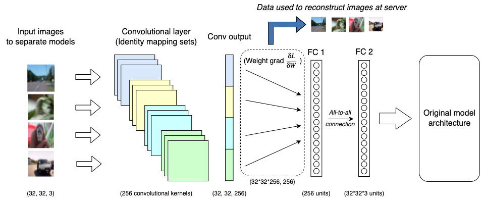

# LOKI: Large-scale Data Reconstruction Attack against Federated Learning through Model Manipulation


*Attack overview*

This repo contains basic code for the attack in the paper <em>LOKI: Large-scale Data Reconstruction Attack against Federated Learning through Model Manipulation</em> [IEEE Digital Library](https://www.computer.org/csdl/proceedings-article/sp/2024/313000a030/1RjEa6sC0I8)     ([arXiv](https://arxiv.org/abs/2303.12233)). The attack is simplified to simulate how the model of a client would update during FedAVG federated learning training. Aggregation is simulated to avoid the need to store the weights/gradients of all updates when there are many clients.

```
Zhao J, Sharma A, Elkordy A, Ezzeldin Y, Avestimehr S, Bagchi S
LOKI: Large-scale Data Reconstruction Attack against Federated Learning through Model Manipulation 
Accepted to IEEE Symposium Security & Privacy, 2024

```

### Abstract: 
Federated learning was introduced to enable machine learning over large decentralized datasets while promising privacy by eliminating the need for data sharing. Despite this, prior work has shown that shared gradients often contain private information and attackers can gain knowledge either through malicious modification of the architecture and parameters or by using optimization to approximate user data from the shared gradients. 

However, prior data reconstruction attacks have been limited in setting and scale, as most works target FedSGD and limit the attack to single-client gradients. Many of these attacks fail in the more practical setting of FedAVG or if updates are aggregated together using secure aggregation. Data reconstruction becomes significantly more difficult, resulting in limited attack scale and/or decreased reconstruction quality. When both FedAVG and secure aggregation are used, there is no current method that is able to attack multiple clients concurrently in a federated learning setting.

In this work we introduce LOKI, an attack that overcomes previous limitations and also breaks the anonymity of aggregation as the leaked data is identifiable and directly tied back to the clients they come from. Our design sends clients customized convolutional parameters, and the weight gradients of data points between clients remain separate even through aggregation. With FedAVG and aggregation across 100 clients, prior work can leak less than 1% of images on MNIST, CIFAR-100, and Tiny ImageNet. Using only a single training round, LOKI is able to leak 76-86% of all data samples.
